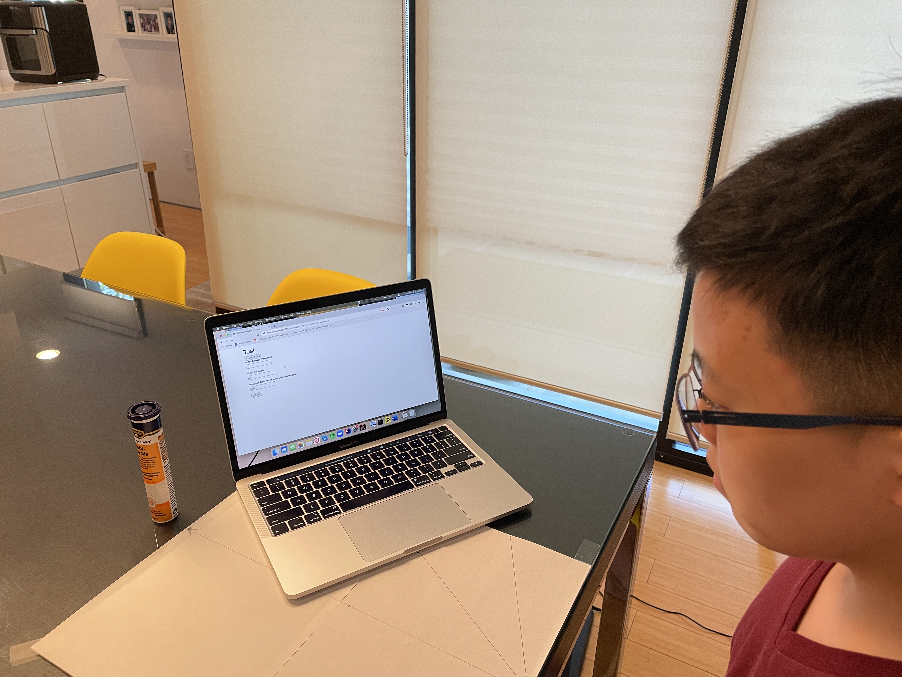

# Methodology

- Brain can count almost instantaneously for small numbers

- Testing near and far peripheral vision (angle) and time for image to flash.

- 60 Tests per person

# Data Collection

- [Website Page](https://github.com/junikimm717/OMSB9-final-project/main/tree/website)

- meant to be run on localhost (very hacky)

# Picture

# Statistical Techniques

1. PMCC for testing standard deviations of errors against number shown.

2. SRCC for testing correlation btwn time displayed and precision.

3. ANOVA for comparing precision across different angles

4. T-test for comparing between near and far peripheral vision
